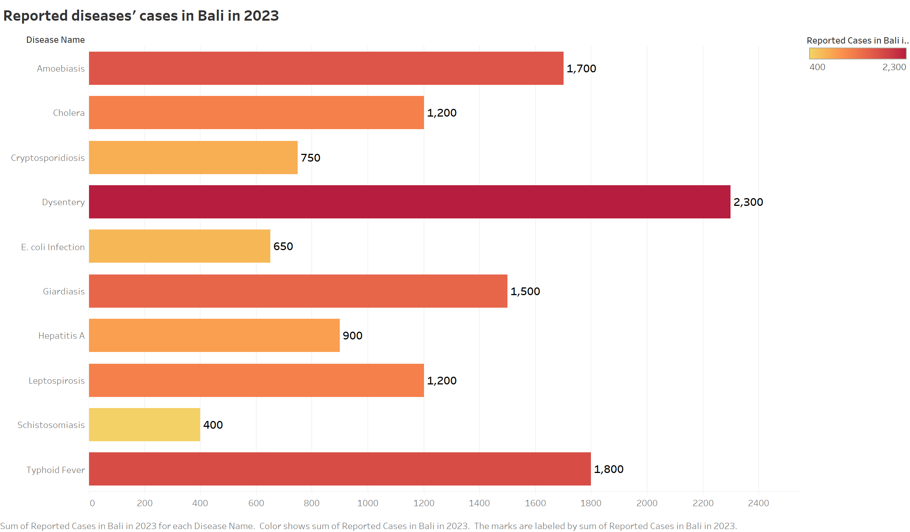

# Bali’s Water Crisis: A Mobile Application
for Clean Drinking Water Access and EcoFriendly Practices

[Project Overview](#project-overview)

Bali, a global tourist hotspot, faces serious water quality challenges that often lead to "Bali Belly," disrupting the dream holiday experience. In response, locals and tourists heavily rely on bottled water, which worsens the island's growing plastic waste problem. To tackle both water contamination and pollution, the Balinese government is rolling out water refill and recycling stations across the island.

Our solution, Bagus Tetes, is a mobile app designed to support this initiative. The app helps users easily locate nearby refill and recycling stations with real-time updates, reducing dependence on plastic bottles. It also promotes sustainable practices through health alerts, educational content, and a rewards system for eco-friendly actions. Users can further support the environment by participating in community clean-ups and ordering safe water for delivery or pickup.

[Project background](#project-background)

Despite government efforts to reduce bottled water use in Bali, concerns over tap water safety have hindered success (IF-Water, 2023). Nearly 42% of urban residents and many tourists still rely on bottled water due to fears of contamination (Cole & Browne, 2015), worsened by the fact that 59% of Indonesia’s rivers are severely polluted, impacting groundwater sources (The Environment and Forestry Ministry, 2021).

To address these issues, the Balinese government, in collaboration with the World Health Organization (WHO) and the Indonesian environmental organization IDEP, has developed a water recycling and filtration system (The Bali Sun, 2023). This initiative integrates with a mobile app that helps users locate filtration stations, access regularly updated water quality reports (Tripadvisor, 2023), and receive push notifications on environmental and pollution issues.

By providing safe drinking water access and promoting awareness of environmental protection, the project aims to reduce reliance on bottled water, cut plastic waste, and foster eco-friendly practices among locals and tourists alike.

[Project goals and objectives](#project-goals-and-objectives)

The goal of this project is to address Bali’s growing water pollution crisis, largely driven by tourism, and to promote sustainable practices among visitors and locals. Bali’s popularity as a top vacation spot has placed immense pressure on its natural resources, particularly water, while contributing significantly to plastic waste.

Key Objectives:
- Assess the impact of tourism on water resources:
> Analyze tourist data to understand how the influx of visitors affects Bali’s water supply and pollution levels.

- Identify water contamination hotspots:
> Use water quality data to pinpoint heavily polluted rivers and beaches frequently visited by tourists, ensuring targeted solutions for safe drinking water access.

- Address health risks from poor water quality:
> Track cases of waterborne diseases, such as "Bali Belly," using health data to create awareness campaigns and provide preventative recommendations for tourists and locals.

- Reduce plastic waste:
> Analyze bottled water consumption data to evaluate the volume of plastic waste generated. Use insights to encourage the adoption of refillable bottles and improve waste disposal in Bali’s rivers and oceans.

> Implement refill stations:
- Collaborate with local businesses and government to install water refill stations across Bali, providing accessible alternatives to bottled water and promoting eco-friendly behaviors.

> Support sustainable tourism:
- Encourage green practices, such as reducing plastic use and supporting businesses committed to environmental sustainability.

> Enhance community involvement:
- Partner with authorities and environmental organizations to strengthen water infrastructure and promote long-term resource protection for Bali’s tourism industry and natural environment.

[Tools](#️tools)

- Excel – Data cleaning, organization, and analysis
- Tableau – Data visualization and dashboards
- Figma – Mobile app UI design and prototyping
- Da Vinci Resolve – Video editing and presentation

[Why Bali?](#why-bali?)

Bali ranks 19th among the world’s top tourist destinations, attracting 8.26 million international visitors annually (Global Destination Cities Index 2019). It is one of the few large-scale tourist attractions in Southeast Asia, alongside major cities like Bangkok, Singapore, and Kuala Lumpur. This high volume of tourism puts immense pressure on Bali's natural resources, particularly its water quality, making it an ideal location to study the environmental effects of tourism.

The heavy tourist influx has led to significant challenges in maintaining clean and accessible water resources. Understanding the impact of tourism on Bali’s environment is crucial to developing sustainable solutions. Given Bali's unique status as a globally recognized destination, this research will contribute to the island's long-term environmental protection and support sustainable tourism practices.

[About the data](#about-the-data)

[Our works](#our-works)

- [Data preprocessing](#data-preproccessing)

- [Data Visualization](#data-visualization)

- [Prototyoe solution](#prototype-solution)

[Project challenges](#project-challenges)

[Project next steps](#project-next-steps)

[Conclusion](#conclusion)

## Project Overview

## Project goals and objectives

##Project roles and background

### The story of Bali

### Tourist persona

## Our works

### Data Visualizations

